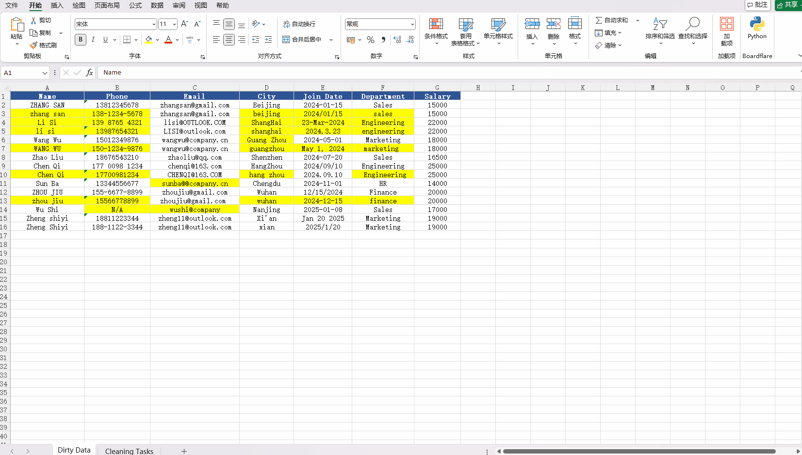

# GLM Excel Custom — Multi-Provider Add-in

[English](#english) | [中文](#中文)

---

## English

A local patch of the official "GLM in Excel" Office add-in that unlocks
OpenAI / Anthropic Claude / any OpenAI-compatible endpoint, served from a
local HTTPS server instead of the official CDN. GLM (ZhipuAI) is retained
as an optional backend.

> **Disclaimer:** This project is an open-source local Excel add-in rewritten based on GLM in Excel (Beta). It is not affiliated with GLM officially and is for learning and reference only — commercial use is prohibited.

## Demo

### Natural Language → Formula
Describe what you need in plain language — AI generates SUMPRODUCT, AVERAGEIFS, INDEX/MATCH and more.


### Data Cleaning & Standardization
Inconsistent names, phone formats, dates? AI batch-cleans messy data in seconds.



### Multi-Model Switching
Run the same task on GPT-4o, Claude, and GLM-4 side by side — pick the model that works best for you.


### Local-First · Data Privacy
Sensitive data like salaries and IDs stays on your machine. AI requests go through a local proxy — nothing leaves your computer.


## How it works

The official add-in loads its frontend from `office-addin.bigmodel.cn` on
every use — it can't be modified in place. This project:

1. Saves the frontend bundle locally under `public/`
2. Patches it (`patch.py`) — unlocks the settings UI, adds multi-provider
   support and per-field `?` tooltips
3. Serves it over a local HTTPS server (`server.cjs`, default port 3000)
4. Registers a custom manifest (`manifest/manifest.xml`) that points Excel
   to `https://localhost:PORT` instead of the official CDN

A built-in CORS reverse proxy at `/proxy/<domain>/...` lets you call APIs
that block browser cross-origin requests.

## Quick start (developer)

**Prerequisites:** Node.js 22+, Windows with Microsoft Excel installed.

```cmd
:: 1. Generate a self-signed localhost cert (one-time)
cd installer
powershell -ExecutionPolicy Bypass -File gen-cert.ps1
cd ..

:: 2. Register the sideload manifest
npx office-addin-dev-settings register manifest/manifest.xml

:: 3. Start the local server (keep this window open while using the add-in)
start-server.cmd
```

Open Excel → **Home** tab → **AI in Excel** → **Settings** → enter your API key.

## Providers & CORS proxy

Switching the provider in Settings auto-fills the base URL via the local proxy:

| Provider | Auto-filled base URL | Recommended Model |
|---|---|---|
| GLM (ZhipuAI) | official endpoint (CORS-enabled, direct) | GLM-5 / GLM-5.1 |
| OpenAI | `https://localhost:PORT/proxy/api.openai.com/v1` | GPT-5.3 codex |
| Anthropic Claude | `https://localhost:PORT/proxy/api.anthropic.com` | claude-4.7 / claude-4.6 |
| OpenAI-compatible | `https://localhost:PORT/proxy/<your-relay-domain>` | Depends on relay |

The proxy at `/proxy/<domain>/<path>` forwards server-side (no CORS
restrictions) and adds the necessary CORS response headers.

Example — using an OpenRouter relay:
```
Provider:  OpenAI-compatible
Base URL:  https://localhost:3000/proxy/openrouter.ai/api/v1
Model:     openai/gpt-4o
API key:   your-key
```

## What the patch does

- **P1** — model-resolution fallback: unknown model names auto-construct a
  default model object so any third-party model name works
- **P2** — settings UI: replaces the locked GLM dropdown with a free-form
  provider selector + base URL + model field, each with a `?` help tooltip
- **P3** — API-key field tooltip
- **P4–P8** — removes upstream GLM/ZhipuAI branding; customize these in
  `patch.py` to add your own
- **P9** — copyright line
- **P10** — removes the upstream "beta" badge
- **P11** — default config (shown on first launch before any settings are saved)

Re-run `python patch.py` at any time to rebuild `taskpane-DG2CZyG2.js` from
the pristine `.orig` backup.

## Customize the branding

1. Edit the strings in `patch.py` sections P4–P9 (app title, about text,
   contact info).
2. Edit `manifest/manifest.xml` — `ProviderName`, `DisplayName`,
   `Description`, `SupportUrl`.
3. Replace the placeholder icons in `public/assets/` and `installer/`:
   - Edit `SRC` / `HEADER_SRC` paths at the top of `make-icons.py`
   - Run `python make-icons.py` (requires `pip install pillow`)

## One-click installer for end users

For users who don't have Node installed (no admin rights required):

```cmd
cd installer
build.cmd
```

Produces `installer/dist/AI-Excel-Setup.exe`. When run it:

- Picks a free port in 3000–3099
- Installs a self-signed localhost cert into the current user's trust store
- Embeds the entire frontend into a Node SEA binary (`AIExcelServer.exe`)
- Creates desktop and Start Menu shortcuts

To uninstall: **Start Menu → AI in Excel → Uninstall AI in Excel**

Key design choices:
- **No admin**: cert goes into `CurrentUser\Root`, files into
  `%LOCALAPPDATA%\AIExcelCustom`, sideload into `HKCU` — no UAC prompt
- **Auto port**: installer scans 3000–3099 for a free port; the frontend
  uses `location.origin` so it follows the port automatically; if the port
  is taken at runtime, the server picks a new one and re-registers the manifest
- **Self-contained**: the frontend JS is embedded in the exe via Node SEA

## Notes

- Cert passphrase for `localhost.pfx`: `localdev` (set in `gen-cert.ps1` and
  `server.cjs`)
- Remove sideload: `npx office-addin-dev-settings unregister manifest/manifest.xml`
- Restore original JS: `copy public\assets\taskpane-DG2CZyG2.js.orig public\assets\taskpane-DG2CZyG2.js`
- The proxy uses direct connections (bypasses system proxy). To route through
  a local proxy (e.g. Clash on 127.0.0.1:7897), add an `undici` `ProxyAgent`
  in `server.cjs`.

## License

The patch scripts, server, and installer code in this repository are released
under the **MIT License**. The original GLM in Excel frontend bundle
(`taskpane-DG2CZyG2.js.orig`) is copyright ZhipuAI and is included here
solely for patching purposes under fair use / personal modification.

---

## 中文

本项目是基于「GLM in Excel」官方 Office 插件的开源本地补丁，解锁了 OpenAI / Anthropic Claude / 任意 OpenAI 兼容端点支持，通过本地 HTTPS 服务器提供服务（替代官方 CDN）。GLM（智谱AI）作为可选后端保留。

> **免责声明：** 本项目是基于 GLM in Excel（Beta）重写的开源本地 Excel 插件，和 GLM 官方无关，仅供学习参考，禁止商业使用。

## 演示

### 自然语言生成公式
用一句话描述需求，AI 自动生成 SUMPRODUCT、AVERAGEIFS、INDEX/MATCH 等高级公式。


### 数据清洗与标准化
姓名大小写混乱、手机号格式不统一、日期五花八门？AI 一键批量清洗。


### 多模型自由切换
同一任务可用 GPT-4o、Claude、GLM-4 分别处理并对比效果，选最适合你的模型。


### 本地运行 · 数据隐私
薪资、身份证等敏感数据全程本地处理，AI 请求经本地代理转发，数据永远不离开你的电脑。


## 工作原理

官方插件每次使用时都从 `office-addin.bigmodel.cn` 加载前端，无法直接修改。本项目：

1. 将前端包保存到本地 `public/` 目录
2. 用 `patch.py` 打补丁 —— 解锁设置界面，增加多供应商支持和字段 `?` 提示
3. 通过本地 HTTPS 服务器（`server.cjs`，默认端口 3000）提供服务
4. 注册自定义 manifest（`manifest/manifest.xml`），让 Excel 指向 `https://localhost:PORT`

内置 CORS 反向代理 `/proxy/<domain>/...` 用于调用不支持跨域的 API。

## 快速开始（开发者）

**前提条件：** Node.js 22+，Windows + Microsoft Excel。

```cmd
:: 1. 生成自签名 localhost 证书（仅需一次）
cd installer
powershell -ExecutionPolicy Bypass -File gen-cert.ps1
cd ..

:: 2. 注册 sideload 清单
npx office-addin-dev-settings register manifest/manifest.xml

:: 3. 启动本地服务器（使用插件期间保持窗口开启）
start-server.cmd
```

打开 Excel → **开始** 选项卡 → **加载项** → **AI in Excel** → **设置** → 输入 API 密钥。

## 供应商与 CORS 代理

在设置中切换供应商时，Base URL 会通过本地代理自动填写：

| 供应商 | 自动填写的 Base URL | 推荐模型 |
|---|---|---|
| GLM（智谱AI） | 官方端点（直连，已支持 CORS） | GLM-5 / GLM-5.1 |
| OpenAI | `https://localhost:PORT/proxy/api.openai.com/v1` | GPT-5.3 codex |
| Anthropic Claude | `https://localhost:PORT/proxy/api.anthropic.com` | claude-4.7 / claude-4.6 |
| OpenAI 兼容端点 | `https://localhost:PORT/proxy/<你的中继域名>` | 取决于中转站 |

代理在服务器端转发请求（无跨域限制），并自动添加必要的 CORS 响应头。

使用 OpenRouter 中转示例：
```
供应商:   OpenAI-compatible
Base URL: https://localhost:3000/proxy/openrouter.ai/api/v1
模型:     openai/gpt-4o
API 密钥: your-key
```

## 一键安装包（普通用户）

无需安装 Node，无需管理员权限：

```cmd
cd installer
build.cmd
```

生成 `installer/dist/AI-Excel-Setup.exe`。运行后：

- 自动选择 3000–3099 中的空闲端口
- 将自签名证书安装到当前用户信任区
- 将整个前端嵌入 Node SEA 可执行文件
- 创建桌面和开始菜单快捷方式

卸载：**开始菜单 → AI in Excel → 卸载 AI in Excel**

## 注意事项

- `localhost.pfx` 证书密码：`localdev`（在 `gen-cert.ps1` 和 `server.cjs` 中配置）
- 移除 sideload：`npx office-addin-dev-settings unregister manifest/manifest.xml`
- 还原原始 JS：`copy public\assets\taskpane-DG2CZyG2.js.orig public\assets\taskpane-DG2CZyG2.js`
- 代理使用直连方式（绕过系统代理）。如需通过本地代理（如 Clash 127.0.0.1:7897），在 `server.cjs` 中添加 `undici` `ProxyAgent`。

## 许可证

本仓库中的补丁脚本、服务器和安装程序代码以 **MIT 许可证** 发布。原始 GLM in Excel 前端包（`taskpane-DG2CZyG2.js.orig`）版权归智谱AI所有，仅出于补丁目的包含在此，属于合理使用 / 个人修改范畴。
