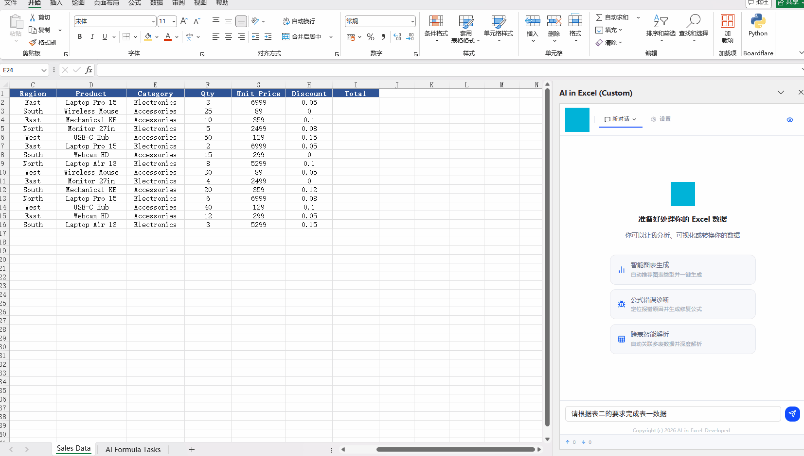
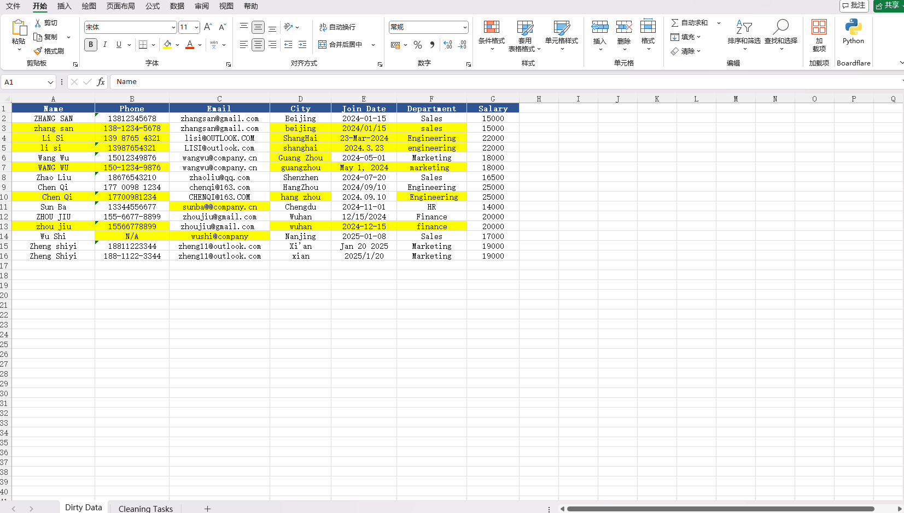

# GLM Excel Custom — Multi-Provider Add-in

[English](#english) | [中文](#中文)

---

## English

A local patch of the official "GLM in Excel" Office add-in that unlocks
OpenAI / Anthropic Claude / any OpenAI-compatible endpoint, served from a
local HTTPS server instead of the official CDN. GLM (ZhipuAI) is retained
as an optional backend.

> **Disclaimer:** This project is an open-source local Excel add-in rewritten based on GLM in Excel (Beta). It is not affiliated with GLM officially and is for learning and reference only — commercial use is prohibited.

## Demo

### Natural Language → Formula
Describe what you need in plain language — AI generates SUMPRODUCT, AVERAGEIFS, INDEX/MATCH and more.



### Data Cleaning & Standardization
Inconsistent names, phone formats, dates? AI batch-cleans messy data in seconds.



### Multi-Model Switching
Run the same task on GPT-4o, Claude, and GLM-4 side by side — pick the model that works best for you.


### Local-First · Data Privacy
Sensitive data like salaries and IDs stays on your machine. AI requests go through a local proxy — nothing leaves your computer.


## How it works

The official add-in loads its frontend from `office-addin.bigmodel.cn` on
every use — it can't be modified in place. This project:

1. Saves the frontend bundle locally under `public/`
2. Patches it (`patch.py`) — unlocks the settings UI, adds multi-provider
   support and per-field `?` tooltips
3. Serves it over a local HTTPS server (`server.cjs`, default port 3000)
4. Registers a custom manifest (`manifest/manifest.xml`) that points Excel
   to `https://localhost:PORT` instead of the official CDN

A built-in CORS reverse proxy at `/proxy/<domain>/...` lets you call APIs
that block browser cross-origin requests.

## Quick start (developer)

**Prerequisites:** Node.js 22+, Windows with Microsoft Excel installed.

Run these steps from the project root. Certificate generation defaults to
**project-root `certs/`**, not `installer/dist/certs/`, and does **not** grant root
trust automatically. You can select another new directory with
`gen-cert.ps1 -OutputDirectory <path>`, but the development server expects the
root `certs/` location. Never reuse a certificate from an old package.

```cmd
:: 1. Generate this machine's localhost certificate (one-time).
powershell -NoProfile -ExecutionPolicy Bypass -File installer\gen-cert.ps1

:: 2. Review the public certificate and its fingerprint before trusting it.
certutil -dump certs\localhost.crt
:: Explicitly trust ONLY this public CRT in the current user's root store.
powershell -NoProfile -Command "Import-Certificate -FilePath certs/localhost.crt -CertStoreLocation Cert:\CurrentUser\Root"

:: 3. Register the sideload manifest.
npx office-addin-dev-settings register manifest/manifest.xml

:: 4. Keep the server window open while using the add-in.
start-server.cmd
```

Trusting a certificate affects other applications using the current user's trust
store too; read [Certificate security and upgrades](#certificate-security-and-upgrades)
before accepting it.

Open Excel → **Home** tab → **AI in Excel** → **Settings** → enter your API key.

## Providers & CORS proxy

Enter the provider's **real HTTP or HTTPS API base URL** in Settings.
The app handles the local proxy automatically; do not manually add a proxy
prefix or local server port. Switching providers fills these defaults:

| Provider | Auto-filled base URL | Recommended Model |
|---|---|---|
| GLM (ZhipuAI) | `https://open.bigmodel.cn/api/paas/v4/` (direct) | GLM-5 / GLM-5.1 |
| OpenAI | `https://api.openai.com/v1` | GPT-5.3 codex |
| Anthropic Claude | `https://api.anthropic.com` | claude-4.7 / claude-4.6 |
| OpenAI-compatible | Empty — enter your provider's real URL | Depends on relay |

HTTP relays, ports and provider-specific paths are supported. OpenAI-compatible
APIs generally require `/v1`; use the path supplied by your provider (the app
does not add it automatically). For Anthropic, a single trailing `/v1` is handled
automatically to avoid a duplicate `/v1/messages` path. Do not include credentials,
query parameters, fragments, or a complete request endpoint such as `/chat/completions`.
Old local proxy URLs are recognized automatically, including an old local server port.

Example — using an OpenRouter relay:
```
Provider:  OpenAI-compatible
Base URL:  https://openrouter.ai/api/v1
Model:     openai/gpt-4o
API key:   your-key
```

Example — using an internal HTTP relay:
```
Provider:  OpenAI-compatible
Base URL:  http://10.0.0.10:8080/v1
Model:     your-model-name
API key:   your-key
```

## What the patch does

- **P1** — model-resolution fallback: unknown model names auto-construct a
  default model object so any third-party model name works
- **P2** — settings UI: replaces the locked GLM dropdown with a free-form
  provider selector + base URL + model field, each with a `?` help tooltip
- **P3** — API-key field tooltip
- **P4–P8** — removes upstream GLM/ZhipuAI branding; customize these in
  `patch.py` to add your own
- **P9** — copyright line
- **P10** — removes the upstream "beta" badge
- **P11** — default config (shown on first launch before any settings are saved)
- **P12** — real URL validation/storage and request-only automatic proxy via
  `public/assets/api-url.js`, including migration of legacy local proxy URLs

The committed `public/` bundle is already patched; a fresh public clone can build
it without Python or a `.orig` backup. Only if you have the **pristine upstream**
`public/assets/taskpane-DG2CZyG2.js.orig`, run `python patch.py` (or
`installer\build.cmd --patch`) to regenerate it. `.orig` files are intentionally
ignored and excluded from SEA. Never copy the patched `.js` into `.orig`.

## Customize the branding

1. Edit the strings in `patch.py` sections P4–P9 (app title, about text,
   contact info).
2. Edit `manifest/manifest.xml` — `ProviderName`, `DisplayName`,
   `Description`, `SupportUrl`.
3. Replace the placeholder icons in `public/assets/` and `installer/`:
   - Edit `SRC` / `HEADER_SRC` paths at the top of `make-icons.py`
   - Run `python make-icons.py` (requires `pip install pillow`)

## One-click installer for end users

End users run a released setup executable without installing Node. **Building**
requires Windows, Node.js 22+, built-in IExpress, and an already-installed
`postject@1.0.0-alpha.6`. The build never downloads tools: it uses that version
under local `node_modules/postject`, or an explicitly selected trusted cached CLI.

`installer/certificate.ps1` is a required source input; an incomplete checkout
fails before build tools run rather than falling back to a shared certificate.

```cmd
:: From the project root.
installer\build.cmd

:: Offline cached tool; separate output preserves an existing setup executable.
installer\build.cmd --postject-path "C:\tools\postject\dist\cli.js" --output "C:\builds\AI-Excel-Setup-20260910-safe.exe"

:: Optional: requires Python and the pristine upstream .orig file.
installer\build.cmd --patch --postject-path "C:\tools\postject\dist\cli.js"
```

Use the real `dist/cli.js`, not an npm `.cmd` shim. Run
`installer\build.cmd --help` for options. Relative paths are resolved from the
project root, regardless of the caller's working directory. The default output
**overwrites `installer/dist/AI-Excel-Setup.exe` only after successful packaging**;
use `--output` to preserve it. Other existing `dist` files are neither read for
packaging nor cleaned. Old packages and old secrets remain there until you review
and remove them yourself; this build does not make them safe to distribute.

Each run creates its own `installer/build/package-*/payload` and an absolute-path
SED, leaving both for inspection. Default builds reuse the committed bundle and
icons: no Python, Pillow, icon regeneration, or certificate generation. The SEA
asset allowlist excludes backups, certificates, keys and development/test inputs.
The IExpress payload is **exactly seven files**:

`AIExcelCustom.exe`, `install.ps1`, `uninstall.ps1`, `launch.vbs`,
`manifest.template.xml`, `app.ico`, `certificate.ps1`.

No PFX/CRT, thumbprint, private key, `certs/`, `gen-cert.ps1` wrapper, historical
`install.log`, port file or runtime state is included.

Installation selects a free port (3000–3099), places per-user files under
`%LOCALAPPDATA%\AIExcelCustom`, registers the sideload in HKCU, and creates desktop
and Start Menu shortcuts. The frontend is embedded in the Node SEA binary
`AIExcelCustom.exe`. Certificate creation happens on the destination machine,
not the build machine. Uninstall via **Start Menu → AI in Excel → Uninstall AI
in Excel**.

### Certificate security and upgrades

- **Per-machine keys, never a bundled private key.** Install/uninstall share
  `installer/certificate.ps1`. Each install/upgrade generates a fresh local key
  in a new directory and trusts its matching public localhost certificate. Never
  distribute or copy the generated `certs/` directory.
- A PFX password of `localdev` is only a file-format compatibility value, **not a
  secret or an access-control boundary**. Private-key protection depends on ACLs
  limited to the current user and SYSTEM, plus user account security; other
  processes with the same user's permissions may still read it.
- `CurrentUser\Root` affects certificate validation for that user's other
  applications too. It is **not app-exclusive trust**. A localhost-only
  certificate does not make installing a root certificate harmless.
- **Upgrading old shared-certificate releases requires more than replacing the
  EXE.** Run the new installer to rotate the key. Caught upgrade failures attempt
  rollback; if cleanup or recovery is denied, the error identifies retained
  recovery files and must not be ignored. Only after success does cleanup remove the validated previous certificate and
  the known shared legacy fingerprint from the relevant current-user stores.
  Uninstall also uses verified fingerprints. Do not delete certificates by
  `CN=localhost` or a broad subject match: unrelated local applications may use
  their own certificates. Do not assume an old uninstaller completed this cleanup.

## Notes

- Never commit development certificates or private keys. Project-root `certs/`
  and common key containers are ignored; `.gitignore` does not untrack secrets
  committed in the past or remove them from old installers.
- Remove sideload: `npx office-addin-dev-settings unregister manifest/manifest.xml`
- Restore original JS only if you possess the pristine `.orig` backup:
  `copy public\assets\taskpane-DG2CZyG2.js.orig public\assets\taskpane-DG2CZyG2.js`
- The proxy uses direct connections (bypasses system proxy). To route through
  a local proxy (e.g. Clash on 127.0.0.1:7897), add an `undici` `ProxyAgent`
  in `server.cjs`.

## Tests

The complete Windows suite contains **97 tests**, covering URL handling, tool
details, public-only packaging, certificate ownership, ACLs, upgrade rollback and
uninstall cleanup. Run with Node's built-in runner and Windows PowerShell 5.1
(no npm dependencies, Python, real installation or certificate-store changes).
PKI/store operations are mocked; ephemeral test keys exercise real PFX parsing.
These checks do not replace end-to-end installation testing in an isolated Windows account:

```cmd
node --test tests/*.test.mjs
:: Build-security checks only:
node --test tests/build-security.test.mjs
```

Build tests run the actual orchestration against temporary fixture directories
and fake only the external SEA/postject/IExpress process boundaries. They check
the exact seven-file package, dirty-dist isolation, private-input exclusions,
fresh-clone/optional-patch behavior and tool failure handling. They are not a
replacement for a Windows package/install acceptance test.

## License

The patch scripts, server, and installer code in this repository are released
under the **MIT License**. The original GLM in Excel frontend bundle is copyright
ZhipuAI. A pristine `taskpane-DG2CZyG2.js.orig` used locally for patching is not
included in the public clone or installer.

---

## 中文

本项目是基于「GLM in Excel」官方 Office 插件的开源本地补丁，解锁了 OpenAI / Anthropic Claude / 任意 OpenAI 兼容端点支持，通过本地 HTTPS 服务器提供服务（替代官方 CDN）。GLM（智谱AI）作为可选后端保留。

> **免责声明：** 本项目是基于 GLM in Excel（Beta）重写的开源本地 Excel 插件，和 GLM 官方无关，仅供学习参考，禁止商业使用。

## 演示

### 自然语言生成公式
用一句话描述需求，AI 自动生成 SUMPRODUCT、AVERAGEIFS、INDEX/MATCH 等高级公式。


### 数据清洗与标准化
姓名大小写混乱、手机号格式不统一、日期五花八门？AI 一键批量清洗。


### 多模型自由切换
同一任务可用 GPT-4o、Claude、GLM-4 分别处理并对比效果，选最适合你的模型。


### 本地运行 · 数据隐私
薪资、身份证等敏感数据全程本地处理，AI 请求经本地代理转发，数据永远不离开你的电脑。


## 工作原理

官方插件每次使用时都从 `office-addin.bigmodel.cn` 加载前端，无法直接修改。本项目：

1. 将前端包保存到本地 `public/` 目录
2. 用 `patch.py` 打补丁 —— 解锁设置界面，增加多供应商支持和字段 `?` 提示
3. 通过本地 HTTPS 服务器（`server.cjs`，默认端口 3000）提供服务
4. 注册自定义 manifest（`manifest/manifest.xml`），让 Excel 指向 `https://localhost:PORT`

内置 CORS 反向代理 `/proxy/<domain>/...` 用于调用不支持跨域的 API。

## 快速开始（开发者）

**前提条件：** Node.js 22+，Windows + Microsoft Excel。

以下命令从项目根目录执行。证书默认生成到**项目根目录 `certs/`**，
不是 `installer/dist/certs/`，且**生成时不会自动加入根信任库**。
可用 `gen-cert.ps1 -OutputDirectory <path>` 指定其他新目录，但开发服务器
默认读取根目录 `certs/`。不要复用旧安装包中的证书。

```cmd
:: 1. 为本机生成 localhost 证书（仅需一次）。
powershell -NoProfile -ExecutionPolicy Bypass -File installer\gen-cert.ps1

:: 2. 核对公共证书及指纹，再决定是否信任。
certutil -dump certs\localhost.crt
:: 仅将刚生成的公共 CRT 显式加入当前用户的根信任库。
powershell -NoProfile -Command "Import-Certificate -FilePath certs/localhost.crt -CertStoreLocation Cert:\CurrentUser\Root"

:: 3. 注册 sideload 清单。
npx office-addin-dev-settings register manifest/manifest.xml

:: 4. 启动本地服务器（使用插件期间保持窗口开启）。
start-server.cmd
```

根证书信任也影响当前用户的其他应用，并非插件独占。操作前请阅读
[证书安全与旧版本升级](#证书安全与旧版本升级)。

打开 Excel → **开始** 选项卡 → **加载项** → **AI in Excel** → **设置** → 输入 API 密钥。

## 供应商与 CORS 代理

在设置中填写服务商提供的**真实 HTTP 或 HTTPS API 根地址**即可。
程序自动处理本地代理，无需手动拼接代理前缀或本机服务端口。切换供应商时自动填写：

| 供应商 | 自动填写的 Base URL | 推荐模型 |
|---|---|---|
| GLM（智谱AI） | `https://open.bigmodel.cn/api/paas/v4/`（直连） | GLM-5 / GLM-5.1 |
| OpenAI | `https://api.openai.com/v1` | GPT-5.3 codex |
| Anthropic Claude | `https://api.anthropic.com` | claude-4.7 / claude-4.6 |
| OpenAI 兼容端点 | 留空，请填写服务商的真实地址 | 取决于中转站 |

支持 HTTP 中转、端口和服务商自定义路径。OpenAI 兼容接口一般包含 `/v1`，
请保留服务商提供的路径，程序不会自动补上；Anthropic 地址末尾的单个 `/v1`
会在请求时自动处理，避免出现重复的 `/v1/messages` 路径。
地址中不要包含用户名/密码、查询参数、片段或 `/chat/completions` 等完整请求端点。
旧版本保存的本地代理地址会自动识别，即使其中的本机服务端口已经变化。

使用 OpenRouter 中转示例：
```
供应商:   OpenAI-compatible
Base URL: https://openrouter.ai/api/v1
模型:     openai/gpt-4o
API 密钥: your-key
```

使用内网 HTTP 中转站示例：
```
供应商:   OpenAI-compatible
Base URL: http://10.0.0.10:8080/v1
模型:     你的模型名
API 密钥: your-key
```

## 一键安装包（普通用户）

普通用户运行发布的安装包，无需安装 Node。**构建安装包**需要 Windows、
Node.js 22+、系统自带 IExpress，以及预先安装的 `postject@1.0.0-alpha.6`。
构建过程不下载工具：默认使用本地 `node_modules/postject` 中的固定版本，
也可显式指定可信缓存中的 CLI。`installer/certificate.ps1` 是必需的源码输入，
缺失时会在运行构建工具前报错，不会退回共用证书方案。

```cmd
:: 在项目根目录运行。
installer\build.cmd

:: 使用离线缓存工具，并输出到独立文件，保护已有安装包。
installer\build.cmd --postject-path "C:\tools\postject\dist\cli.js" --output "C:\builds\AI-Excel-Setup-20260910-safe.exe"

:: 可选：仅重打补丁时需要 Python 和原始 .orig 文件。
installer\build.cmd --patch --postject-path "C:\tools\postject\dist\cli.js"
```

请指定真实的 `dist/cli.js`，不要指定 npm 的 `.cmd` 包装脚本。
`installer\build.cmd --help` 查看参数；相对路径始终相对于项目根目录解析，
不受启动目录影响。默认输出会在打包成功后**覆盖
`installer/dist/AI-Excel-Setup.exe`**，需要保留旧包时请用 `--output`。
其他现有 `dist` 文件不会被读取打包，也不会被清理；其中旧证书、旧包仍需
单独审查处理，新构建流程不会让旧文件自动变得适合分发。

每次构建使用独立的 `installer/build/package-*/payload` 和绝对路径 SED，
保留供检查。普通构建直接复用已提交的前端及图标，**不需要 Python、Pillow
或 `.orig`**，也不会生成图标或证书。SEA 静态资源白名单排除备份、证书、
密钥及开发/测试输入。IExpress 安装包**严格只有 7 个载荷文件**：

`AIExcelCustom.exe`、`install.ps1`、`uninstall.ps1`、`launch.vbs`、
`manifest.template.xml`、`app.ico`、`certificate.ps1`。

不含 PFX/CRT、指纹文件、私钥、`certs/`、`gen-cert.ps1` 包装脚本、历史
`install.log`、端口或运行状态。公开克隆中的前端已经打好补丁；仅当你拥有
原始上游 `public/assets/taskpane-DG2CZyG2.js.orig` 时才使用 `--patch`。
`.orig` 不提交、不嵌入 SEA，**不要把已修改的 JS 复制成 `.orig`**。

安装后：

- 自动选择 3000–3099 中的空闲端口
- 在目标机器生成新的 localhost 私钥/证书，并信任对应公共证书
- 将程序安装到 `%LOCALAPPDATA%\AIExcelCustom`，通过 HKCU 注册加载项
- 前端嵌入 `AIExcelCustom.exe`，创建桌面和开始菜单快捷方式

卸载：**开始菜单 → AI in Excel → 卸载 AI in Excel**

### 证书安全与旧版本升级

- **每机生成，不随包分发私钥。** 安装与卸载共用 `installer/certificate.ps1`；
  每次安装/升级在新目录生成并轮换本地密钥，仅信任与之对应的公共证书。
  不要上传、分发或跨机器复制生成的 `certs/`。
- PFX 密码 `localdev` 只是格式兼容值，**不是秘密，也不是安全访问边界**。
  私钥安全依赖仅授予当前用户和 SYSTEM 的文件 ACL，以及账户本身的安全；
  拥有相同用户权限的其他进程仍可能读取它。
- `CurrentUser\Root` 会影响该用户其他应用的证书验证，**不是本应用独占信任**。
  即使证书限定 localhost，也不能把添加根信任描述成完全无害。
- **从旧共用证书版本升级不能只替换 EXE。** 请运行新安装器轮换密钥；
  捕获到升级失败时会尝试回滚；清理或恢复被拒绝时，错误会指出保留的恢复目录，
  不能忽略该提示。仅成功后才按经过验证的旧证书指纹及已知共用证书的精确指纹
  清理相关当前用户证书库。卸载同样使用已验证的指纹，不按 `CN=localhost`
  或宽泛主题名批量删除，以免误伤其他本地应用。不要假设旧版卸载器已完成清理。

## 注意事项

- 不要提交开发证书或私钥。根目录 `certs/` 及常见私钥容器已忽略，但
  `.gitignore` 不会撤回过去已提交的秘密，也不会清理旧安装包。
- 移除 sideload：`npx office-addin-dev-settings unregister manifest/manifest.xml`
- 仅当拥有原始 `.orig` 备份时还原 JS：`copy public\assets\taskpane-DG2CZyG2.js.orig public\assets\taskpane-DG2CZyG2.js`
- 代理使用直连方式（绕过系统代理）。如需通过本地代理（如 Clash 127.0.0.1:7897），在 `server.cjs` 中添加 `undici` `ProxyAgent`。

## 测试

Windows 完整测试共 **97 项**，覆盖 URL、工具详情、无私钥打包、证书归属、
ACL、升级回滚及卸载清理。使用 Node 自带测试器和 Windows PowerShell 5.1，
无 npm 依赖，不需要 Python，不执行真实安装或修改证书库。
PKI/信任库操作使用模拟，临时内存测试密钥用于验证真实 PFX 解析；
这些检查不能替代隔离 Windows 用户下的完整安装验收：

```cmd
node --test tests/*.test.mjs
:: 仅运行构建安全测试：
node --test tests/build-security.test.mjs
```

构建测试在临时 fixture 目录运行真实编排，仅替换外部 SEA/postject/IExpress
进程边界，验证精确 7 文件、污染 dist 隔离、私密输入排除、公开克隆无需
`.orig`、可选补丁及子步骤失败处理；不能替代 Windows 真实打包/安装验收。

## 许可证

本仓库中的补丁脚本、服务器和安装程序代码以 **MIT 许可证** 发布。
原始 GLM in Excel 前端包版权归智谱AI所有；本地用于打补丁的原始
`taskpane-DG2CZyG2.js.orig` 不包含在公开克隆或安装包中。
